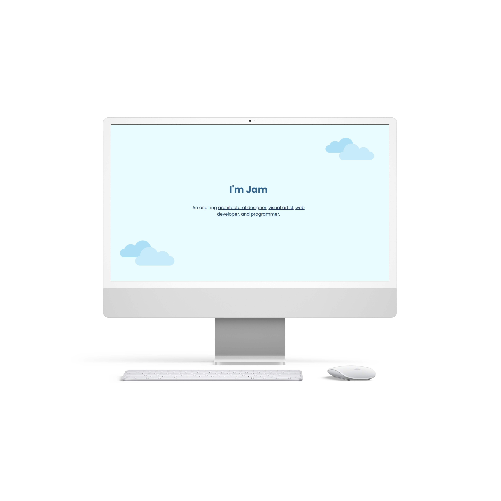
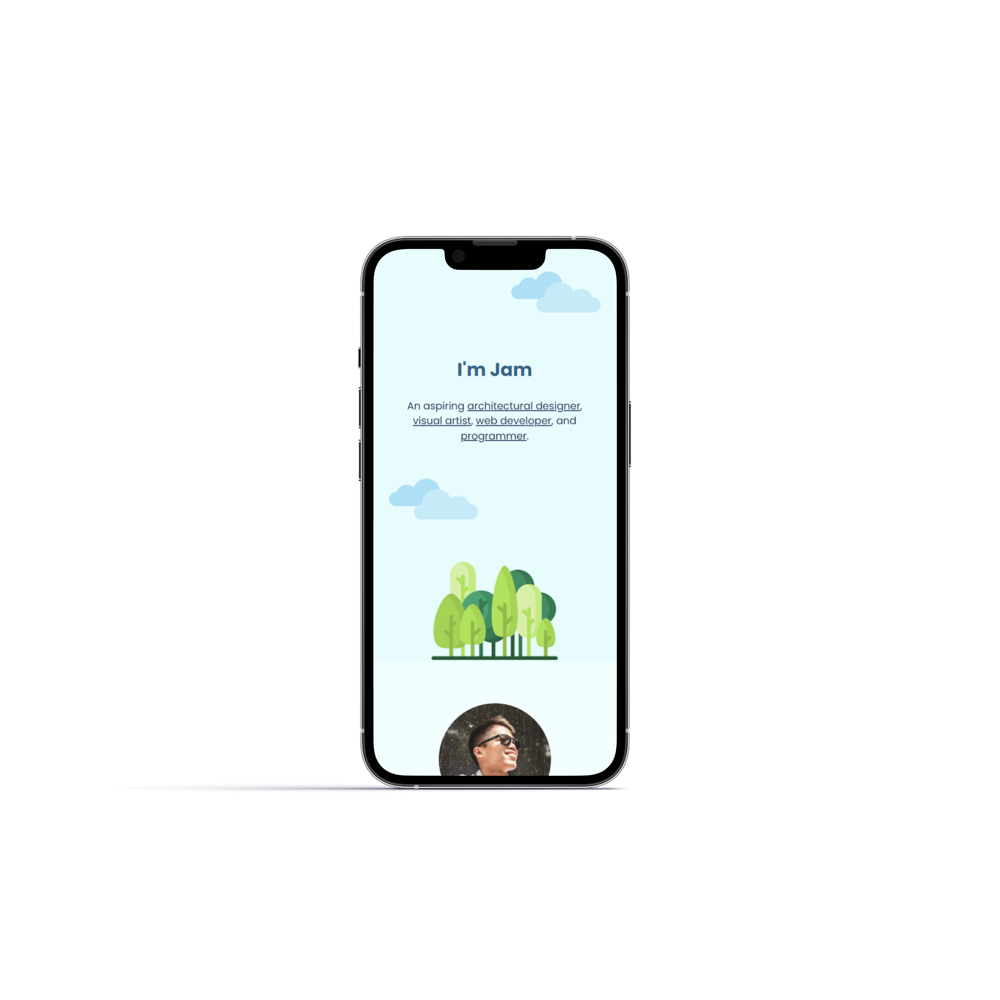
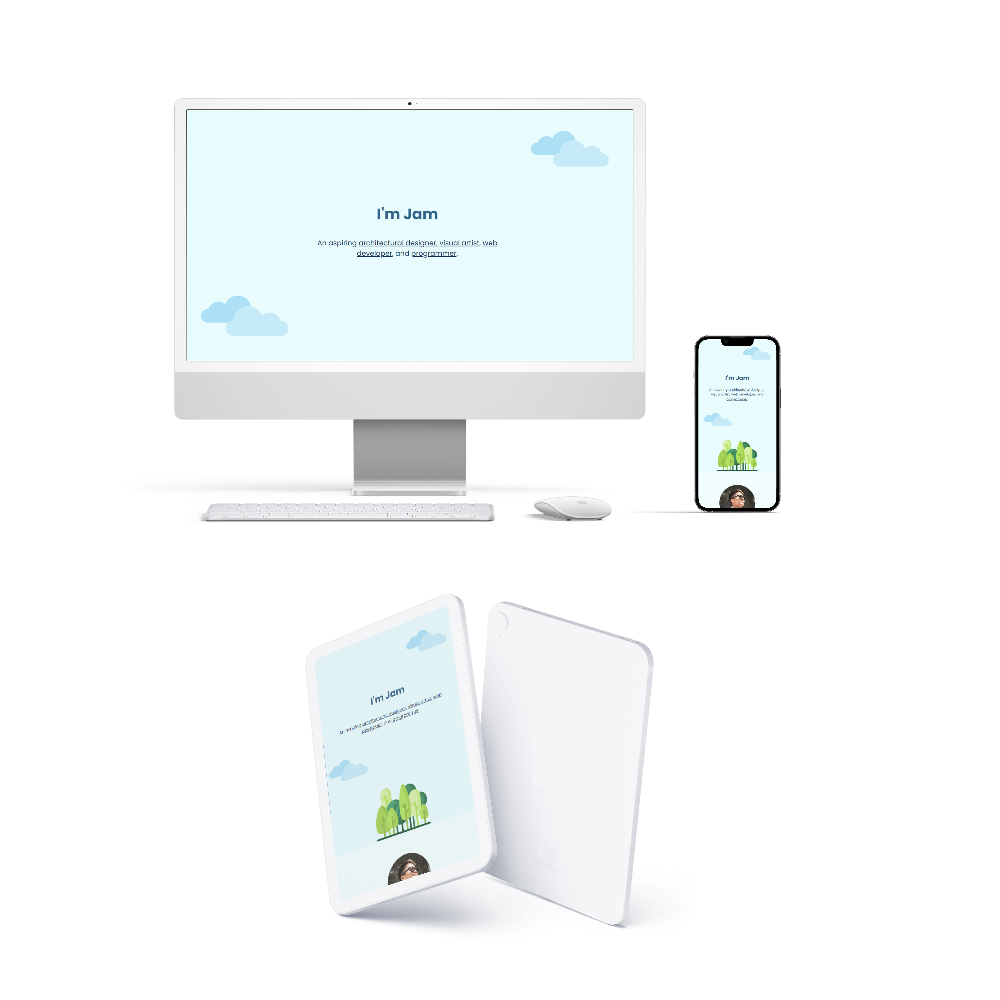

<!-- markdownlint-configure-file {
  "MD013": {
    "code_blocks": false,
    "tables": false
  },
  "MD033": false,
  "MD041": false
} -->

  

# "Mark Website" Project of Mark Dhel Villarama

This is a sample simple project of a website featuring my interests and what I 
like and love to do. 👋 (Mark Website)

## Website

🖥️ [#]

✍️ Project by Mark Dhel Villarama

## Responsive Design

🪟: [Desktop - Tablet - Mobile]

